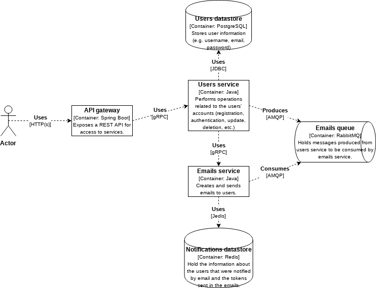

# microservices-example
This is an example of a web application with a microservices architecture.

I will try to include and test different technologies in this project, including: 
- Spring boot
- gRPC
- OAS
- Redis
- RabbitMQ
- JWT
- More to come soon...

As we can see in Fig. 1, the web application that is presented here follows a microservices architecture. Now, it just includes mechanisms to support the registration, authentication, authorization and other similar operations, useful to enable access to multiple users in web applications. 
We are allowing external actors to access the application through HTTP(s) using the API gateway. This gateway will redirect the requests to appropriate services hidden from the user using gRPC. 
The users service will contain all the information associated with the users' accounts. It will enforce users to confirm their accounts prior to be able to login and to do further actions. This will require the production of messages that are sent to RabbitMQ and consumed by the emails service, which creates emails and sends them to users. The emails service will also be useful to recover passwords when the user doesn't remember his password.
Authentication can be done on the API gateway using JWT after requesting a token from the users service. Thus, if a user isn't authorized to access some resource, the request is rejected right on the API gateway.

 
*Fig. 1: Web application's current architecture*

## TODO:
- This application will be extended... wait for it... ;)
- Information will also be updated